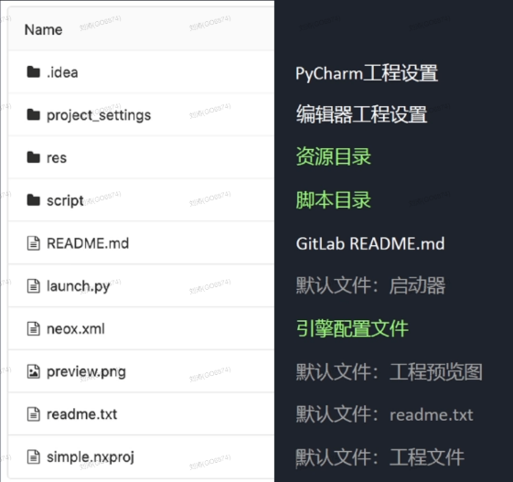
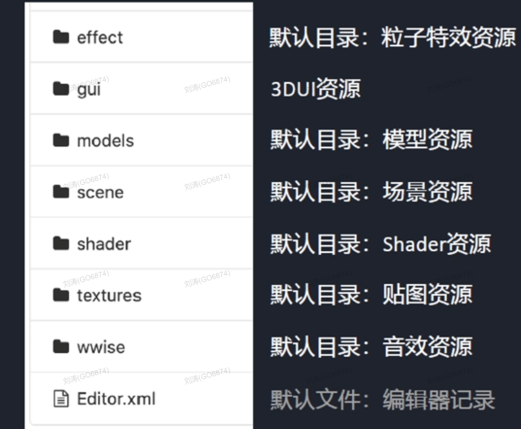
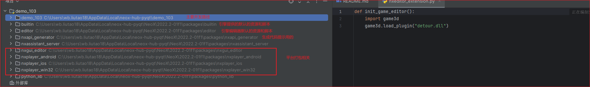

# NeoX引擎介绍和入门：

## 引擎简介

## Demo103

init.py:引擎默认会跑的第一个脚本文件,init.py中先找到init函数，再找到start函数。并且会载入4个模块：

- collision用来处理碰撞的
- world模块包含3D场景的主要功能。
- cocosui和nxgui是用来制作界面的。

tutorial.py:该脚本用于演示基本的场景加载已经摄像机控制功能

Scene(world1)：NeoX的场景文件，负责存储world1对象，不支持组件

GameLevel(world2)：负责存储world2对象

Entity：组件的容器，无法成为基类

Component：组件，包含了功能逻辑的数据。

Actor：内部包含一个Entity，含有固定组件的游戏Actor，可以派生出许多游戏Actor。

NPrefab：预制体，等价Unity的Prefab，是一组游戏物体的资源。

ScriptComponment：脚本组件，可以被Python继承。

Transform(Component)：变换组件，world2下的变换。

##### 生命周期函数：

on_init：初始化回调

on_activate：激活时回调

on_start：在on_activate后延后一帧，第一次on_update之前。

on_update：on_start后每帧调用

on_late_update：每帧on_update后调用

on_deactivate：与on_activate成对调用

on_destroy：销毁时回调

