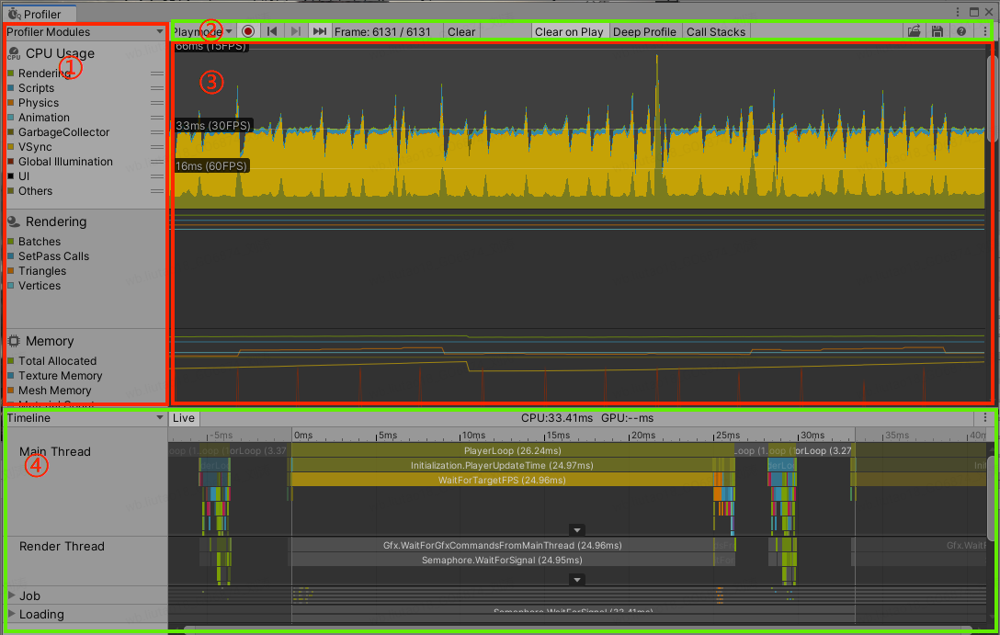

# Unity性能分析之Unityprofiler使用

> Unity性能分析器（Unityprofiler）是一种可以用来获取游戏运行时性能信息的工具。在使用Unity开发游戏的过程中，借助Profiler来分析CPU、
>
> GPU及内存使用状况至关重要的。

## Unity性能分析器

> Unity性能分析器（Unityprofiler）是一种可以用来获取游戏运行时性能信息的工具。性能分析器可对一下三种工作场景进行设备的数据采集：
>
> 1. 通过无线方式连接到PC的设备，它们通常是已连接到网络中的设备（例如：手机、平板、另一台PC等）
> 2. 通过USB等有线方式连接到PC的设备
> 3. 直接在Unity编辑器内运行游戏
>
> 性能分析器可以收集并显示有关应用程序各个方面的性能数据（例如：CPU、内存、帧率等），并通过图表的形式进行展示，因此可以直观的查
>
> 看游戏在各个时刻的性能状态。

可以使用以下两种方式打开Unityprofiler：

> 菜单栏打开：在unity编辑器界面菜单栏依次选择Window>Analysis>Profiler打开
>
> 快捷键打开：Windows(Ctrl + 7)、macOS(Command + 7)

 上图为打开后的Unity profiler窗口的视窗界面，将其简单分为4个不同的区域，分别用数字①、②、③、④代替，它们的含义如下：

 ① **性能分析模块区域**：在profiler中支持性能分析的模块列表，使用此区域顶部的菜单（Profiler- Modules）可在该区域内添加和删除模块。

>  ***** 分析模块中具体的指标数据支持**点击关闭**和**自定义顺序排列**，这些操作都会实时的同步到区域③（帧图表区域）中

 ② **性能分析器控件**：能够控制Unity profiler的绝大部分内容，具体的控件功能如下所示：

**Playmode**：使用此控件可设置对哪个设备进行性能分析，默认对当前打开的编辑器运行的游戏进行分析；

**圆点控件**：控制Unity profiler采集性能参数的开启和暂停；

**左右箭头控件**：在不同的帧数据之间进行回退和前进操作；

**Frame**：统计Unity profiler已记录的所有帧数和当前所处帧数情况，当鼠标选中区域③（帧图表区域）中的

某一帧时，此处会显示当前选中的是哪一帧的画面；

**Clear**：清屏帧图表区域；

**Clear on Play**：启用此设置后，当下次在窗口中单击采集数据或连接到新目标设备时，将会删除当前分析器窗口中所有的数据；

**Deep Profile**: 该功能主要用于更精准的跟踪各个数据（可查看函数的具体消耗和GC情况，包括调用栈信息等），但同时会消耗更多的性能资源；

**Call Stacks**：启用此控件功能后，将记录用于内存分配的调用堆栈信息；

**打开控件**：读取本地已保存的数据，将保存的分析器数据加载到分析器窗口；

**保存控件**：保存当前已记录的数据，通过[Profiler.logFile ](https://docs.unity3d.com/2019.3/Documentation/ScriptReference/Profiling.Profiler-logFile.html)API 保存已经写出到文件的数据；

**Context Menu**: 此选项中包含3个功能选项（ColorBindMode、Show Stat for "Current Frame"、Preference），它们的含义分别是：

- ColorBindMode：此设置可使帧图表区域在图形显示中使用更高的对比度颜色；
- Show Stat for "Current Frame"：记录过程中一直显示当前帧的对应的图表上的数据
- Preference：Preferences菜单，用以设置分析器的其他功能，比如实时记录帧数的数量设置等

 ③ **帧图表****区域**：此区域包含性能分析器中每个指标的图表信息。鼠标左键可以选择不同时刻的帧画面信息。选择后会出现一条竖线，竖线和各个性能指标相交点的值即为这一时刻的性能参数。

 ④ **模块详细信息面板**：此区域中显示的信息将由用户选中的模块（在性能分析器模块区域中选择）决定。例如上图中选择的是 CPU Usage 模块，则此区域包含了详细的时间轴图像和Hierarchy视图内容。

> ***** 窗口默认显示最新的**300**帧性能数据，可以在 Preferences 窗口（File > Preferences）中增加实时记录的帧数（最多**2000**帧，**但由此对性能分析器本身会带来比较大的开销和内存占用**）