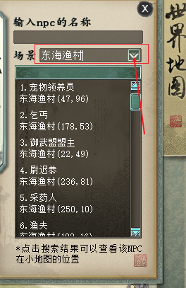

## 项目实用接口记录

- 界面风格切换函数：update_current_style

- 退出游戏：exit_game()

- 展示确认框：show_confirm_dlg

- 创建并注册对话框：create_from_template（）、

- 信息日志（证明事情按预期工作）：logger.info()

- 格式化数据：_format()

- 调试日志(一般只在调试问题时使用)：debug()

- 错误日志（由于更严重的问题, 软件“已不能”执行一些功能了"""）：error()

- 警告日志（ 某些“没有预料到的”事件的提示, 或者在“将来”可能会出现的问题提示。例如：磁盘空间不足。但是软件还是会照常运行）：warning()

- 定时分帧处理预载接口（将许多初始化工作也加入其中，需要预载的ui conf配置，列表项：有些带有determine_wraptype参数的，则用tuple表示，否则默认conf_name即可）：FramePreloader

- 内服中间服：1，外服中间服：2

- 登录数据管理者：LoginDataMgrBase

- 应用设置界面的操作：apply_system_settings()

- 判断文件编码格式：guess_encoding();

- 全局录像播放参数：gdata.py中 self.rec_play_mode

- 是否调试模式：is_debug_mode

- 获取登录样式：RecordManager().get_login_style()

- 获取当前界面风格：get_current_style（）

- 设置界面风格函数：reset_login_ui_style

- 全局任务分帧处理管理器(即将某种可能在一帧内集中爆发且容易造成卡顿的任务，按顺序移交给后续帧处理)：TaskDelayManager()

- 显示提示：show_message()

- 解包：unpack_list()

- 字符串编码转化通用工具:将任意数据结构的数据中的bytes类型数据的编码转化为utf-8

- 设置屏幕分辨率：set_screen_size

- 背景底图界面：LoginBgUI()

- 控件中心：common.uielem

- 创建界面从配置中create_from_config

- 配置新活动入口：info_main_activity文件

- 活动入口对应端游的common\utils.lua的gf_create_gift_bag_panel：main_activity_ui中的ActivityUI

- 文本对齐：0是居左，1是居中，2是居右

- 保存系统设置，其他子系统在应用完自己的设置后，可以直接调用此函数进行保存：common.setting_utils里面的save_system_settings_new()

- 清除定时器：cancelTimer

- 添加定时器：addTimer

- 图片隐藏/显示:图片.visible

- 显示/隐藏 提示：.task_tips_ui 类中

- 显示提示：show_task_tips

- 隐藏提示：try_hide_task_tips

- 打开大话精灵：ask_help_click

- 显示任务提示对话框：show_task_tips_dlg

- 显示子任务提示：show_child_task_tips

- 列表元素设置值：item.get("Key") = ...

- 列表移除所有元素：remove_all_items

- 列表添加数据：attach_data

- 列表跳转到列表中的特定索引位置:jump_to_index

- 界面音效是否开启：_auto_sound_on

- 是否可以触发音效：_enable_play_sound

- 是否播放界面关闭音效：_auto_create_sound_on 

- 播放UI音效（用于UI操作，和系统消息提示音效）：play_addon_sound()

- 多个路径组合成一个路径：os.path.join()

- 获取neox 可读写目录: path.get_neox_dir()

- 获取有效的扩展npk资源列表文件: path.get_res_download_file()

- 获取资源的下载目录:get_res_download_dir()

- 获取patch目录:get_patch_dir()

- 获取扩展包目录：get_pkg_ext_dir()

- 获取uiconf界面配置完整路径: get_uiconf_path

- 文件删除：safe_remove（）

- 通用创建临时目录的接口 如果要多次使用临时目录，需要在模块中保存临时目录，防止多次创建：create_xy2tmp_dir

- 创建目录：safe_makedirs

- 验证文件路径目录是否存在：safe_makedirs_for_path

- 重新加载目录：safe_reload_package_dir

- 获取文件crc32:Pget_file_crc32()

- 获取造型资源的前缀:get_2dshape_res_path_prefix()

- 获取默认变色pp文件路径:get_default_pp_res_path()

- 获取小孩造型资源前缀：get_child_2dshape_res_path_prefix（）

- 获取战斗入场特效资源前缀：get_war_entry_effect_res_path_prefix

- 获取web数据：CalendarWebDataManager 中的get_web_data

- 获得道具后的动画：GetItemUI

- 设置全局启用加载plist：set_global_enable_load_plist（）

- 获取场景属性信息：get_scene_property_info（）

- 获取场景夜晚id：get_scene_night_id(scene_id)

- 获取天气资源id：get_weather_res_id

- 获取场景资源id：get_scene_res_id

- 获取小地图路径：get_scene_smap_path

- 判断该场景是不是可飞行的场景：is_can_fly_scene

- 判断该场景是不是可以打开小地图：is_can_open_smap

- 获取场景名称：get_scene_name()

- 登录相关优化开关：self.enable_login_speed_opt = check_is_test_or_not_release_client()

- 加载客户端场景添加的 NPC:load_client_npcs()

- 根据场景id添加场景特效：add_scene_stuff()

- 弹出性能提示框：show_performance_tips_dlg()、

- 获取场景大小/获取场景尺寸/获取场景宽高：get_scene_size（）

- 正式加载场景特效：begin_add_scene_stuff

- 当前场景：global_bultins：global_scene

- 播放FMOD格式的法术音效：play_fmod_magic_sound

- 播放特效音效：play_effect_sound

- 天气管理者：WeatherMgr

- 支持天气效果的场景

  WEATHER_SCENE_MAP = {1410, 3410, 1943, 3943}

  WEATHER_IGNORE_MAP = {1944}  # 1944:过去的长安

  夜晚场景列表

  NIGHT_SCENE_MAP = {3410: 1943, 3943: 1943}

- 获取天气数据：get_weather_data

- 获取全部天气数据：get_weather_data_all

- 获取场景配置：get_scene_conf

- 刷新鼠标指针状态：refresh_mouse_move（）

- 创建的item是个button：onCreateItemButton（）

## 项目场景应用

- 给下拉框添加选项

  

​	attach_data（数据，按钮切换事件），具体可参考：world_map_ui_2019.py。

- 

## 项目重要网站记录：

